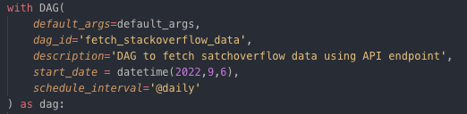

<h1 align="center">ETL PIPELINE FROM S3 TO REDSHIFT BY IaC</h1>

    
    
    
    

### OVERVIEW
> [!NOTE]
> This project focuses on utilizing Apache Airflow to orchestrate an ETL (Extract, Transform, Load) process using data from the Stack Overflow API. The primary objective is to determine the most prominent tags on Stack Overflow for the current month. The workflow involves fetching data from the API, transforming it using Pandas, and loading the processed data into an Amazon S3 Bucket.

### Tech Stack and Knowledge
    

- Data warehouse knowledge
    - Database design
    - ETL
- Tech/Framework used
    - SQL
    - Python SDK for AWS (boto3)
    - Airflow: Automate pipeline

### Project Introduction
1. Project Introduction
- In this project, my aim is to apply the knowledge I've acquired about Airflow. The data employed in this ETL process will be sourced from the Stack Overflow API, accessible here. The extraction revolves around the query, "What are the most prominent tags on Stack Overflow this month?" The workflow orchestrated by Airflow will involve:
    - Fetching data from the Stack Overflow API endpoint
    - Employing Pandas for data transformation
    - Loading the processed data into an Amazon S3 Bucket
- The simple pipeline is described as below.

2. Hands-on
- CREATE AWS S3 BUCKET
    - Log in to AWS and search S3 and select S3 Scalable storage in the Cloud

    

    - From S3 dashboard, click on Create Bucket

    

    - Enter a bucket name and AWS region

    

- FETCH DATA FROM API ENDPOINT TO AWS S3 BUCKET
    - Download all the required libraries
    - Create a function get_stackoverflow_data() to get the data using the request library.
        
        

        - Ti stands for task instance. It is used to call Xcoms_push and Xcoms_pull. Xcoms stands for cross communication where tasks can communicate each other. 
            - Xcoms_push is used to push the data to task storage on the task instance
            - Xcoms_pull is used to pull the data on task storage on the task instance
- TRANSFORM DATA 
    - Create a function transform_data() to remove the all the redundant columns
    
    

    - After transforming, push data back to task storage on the task instance for the next task.
- LOAD TRANSFORMED DATA TO AWS S3 BUCKET
    - Boto3 is the python SDK for AWS which allows us to read, create, delete and update resources from python code.
    - Create a temporary file and putting transformed data in it and then push it to AWS S3. 

    

- AIRFLOW DATA PIPELINE DAG
    - DAG Default Argument: specifies all defaults properties such as owner, retries, retry_daily...

        

    - DAG Instance: We create a DAG object to nest our tasks into and pass all basic properties such as dag_id, schedule_interval...

        

    - DAG tasks and dependencies: This is place where tasks are created using BashOperator or PythonOperator. Tasks and task-flow are specified here. The dependencies are set using ">>" operators. 

        

    - Go to localhost where Airflow UI is running, log in and check for created DAG.

        

    - Dark green means that DAG run successfully and tasks completed. 
 
        
